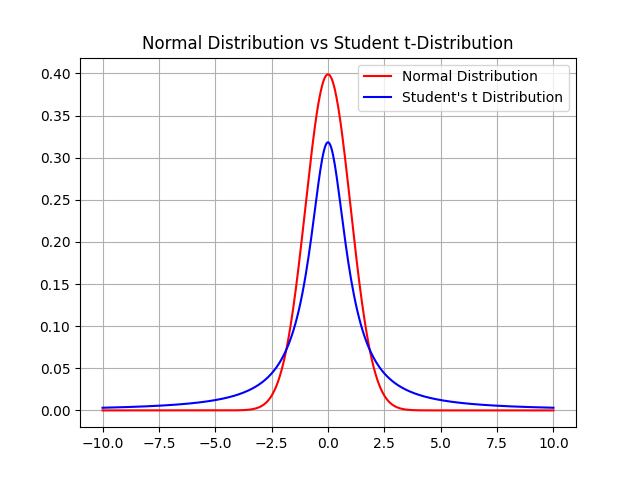
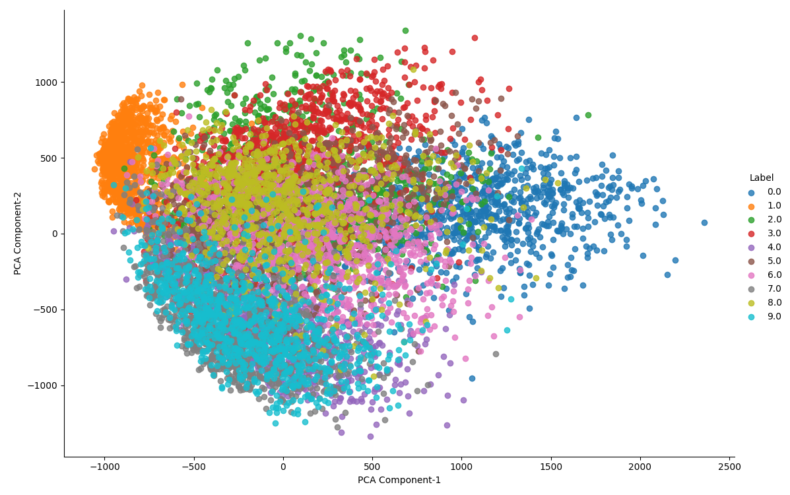
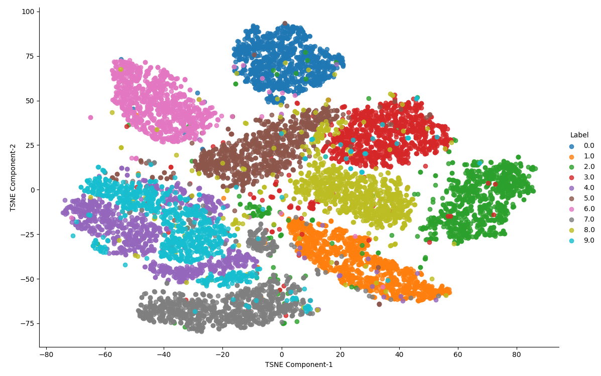

# t-Distributed Stochastic Neighbor Embedding (t-SNE)
t-Distributed Stochastic Neighbor Embedding (t-SNE) is an unsupervised, non-linear technique primarily used for data exploration and visualizing high-dimensional data.
In simpler terms, t-SNE gives you a feel or intuition of how the data is arranged in a high-dimensional space.

The t-SNE algorithm calculates a similarity measure between pairs of instances in the high dimensional space and in the low dimensional space.
It then tries to optimize these two similarity measures using a cost function.

## Distribution for Measuring Similarity
Student t Distribution with Degree of Freedom = 1 is used for Measuring Similarities.\
The plot below is between Student t Distribution with Degree of Freedom = 1 and Normal/Gaussian Distrubution are used for Measuring Similarities. It can be observed thatthe Student t-distribution has heavier tails than the normal distribution

## Dataset
MINST Handwritten-Digits Train Dataset is considered and 200 points are extracted giving equal weightage to all class.

## Results on appyling PCA
The following is the Visualisation on applying PCA to the Dataset

## Results on applying t-SNE
The following is the Visualisation on applying t-SNE to the Dataset

